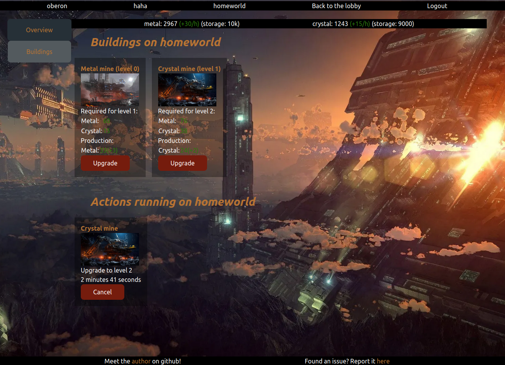
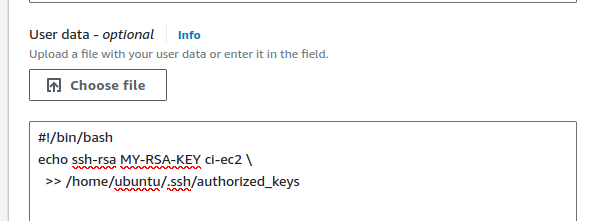
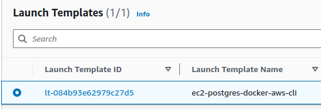
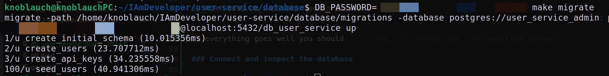
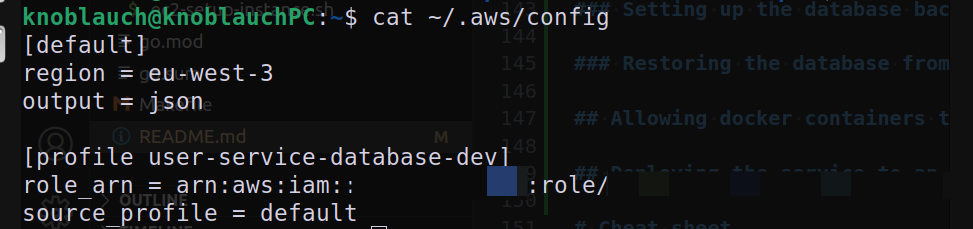
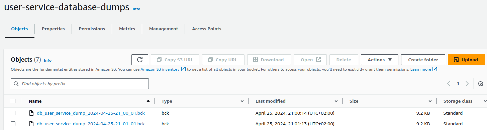
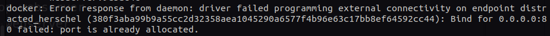

# galactic-sovereign

This repository is a monorepo containing the services needed to power the [gasteropo.de](https://gasteropo.de) website.

On this website you can find an online multiplayer web-browser game titled **Galactic Sovereign**. This is a strategy game where the players can mine resources on their respective planets and improve the infrastructure to do so by upgrading their mines. It is largely inspired by the basics of [OGame](https://en.wikipedia.org/wiki/OGame), a famous strategy game.

Below is a screenshot of the welcome page:


Here is a view of the lobby:


And a screenshot of the actual game:



The goal of this project is to progressively migrate to a unique game concept, building the services needed for it and learning how to do it along the way.

# Overview

This project uses the following technologies:

- [postgres](https://www.postgresql.org/) for the databases.
- [AWS](https://aws.amazon.com/) as a cloud provider to deploy the website services.
- [namecheap](https://www.namecheap.com) as a provider for the domain of the website.
- [go](https://go.dev/) as the server backend language.
- [sveltekit](https://kit.svelte.dev/) as the frontend development framework.
- [docker](https://www.docker.com/) as the containerization tool to deploy services.
- [dockerhub](https://hub.docker.com/) to host the images of services and make them available.
- [docker compose](https://docs.docker.com/compose/) to handle the orchestration of the cluster of services powering the website.
- [traefik](https://traefik.io/traefik/) as a reverse proxy to route the traffic to the services of the cluster.

As this is a project to learn things without being a money sink, some aspects of the management of the website are handled with in-house solutions when they could use existing commercial software.

# Badges

[](https://codecov.io/gh/Knoblauchpilze/galactic-sovereign)

[](https://github.com/KnoblauchPilze/galactic-sovereign/actions/workflows/build-and-deploy.yml)

# Installation

## Prerequisites

The tools described below are directly used by the project. It is mandatory to install them in order to build the project locally.

See the following links:

- [golang](https://go.dev/doc/install): this project was developed using go `1.23.2`.
- [golang migrate](https://github.com/golang-migrate/migrate/blob/master/cmd/migrate/README.md): following the instructions there should be enough.
- [postgresql](https://www.postgresql.org/) which can be taken from the packages with `sudo apt-get install postgresql-14` for example.
- [docker](https://docs.docker.com/engine/install/ubuntu/#install-using-the-repository) which can be installed following the instructions of the previous link.
- [AWS cli](https://docs.aws.amazon.com/cli/latest/userguide/getting-started-install.html#getting-started-install-instructions) which can be installed using the instructions in the previous link.
- [node and npm](https://nodejs.org/en/download/package-manager) which can be installed using the instructions in the previous link.

We also assume that this repository is cloned locally and available to use. To achieve this, just use the following command:

```bash
git clone git@github.com:Knoblauchpilze/galactic-sovereign.git`
```

## Process to install

The following sections describe how to setup an AWS account so that it can be ued to host the website defined by this repository. This includes:

- setting up S3 buckets for the database back-up process.
- starting an EC2 instance and configuring it.
- setup the databases on the remote instance.
- generalities about the deployment process.

In addition, the following sections expect that you have access to several (secured) passwords to be used for the various users needed by the databases. The current architecture requires **3** passwords per database. It is recommended to have separate passwords and not reuse them.

## RSA key pair

To interact with an EC2 instance we need to have access to an RSA key pair. Several ways exist to do this including letting AWS manage the key. We describe a way to generate it yourself.

### Generate a RSA key pair

In order to generate the RSA key pair and the `pem` file you can first follow this [github link](https://docs.github.com/en/authentication/connecting-to-github-with-ssh/generating-a-new-ssh-key-and-adding-it-to-the-ssh-agent#generating-a-new-ssh-key) to generate a new ssh key and then this [server fault link](https://serverfault.com/questions/706336/how-to-get-a-pem-file-from-ssh-key-pair) to create a `pem` file from it.

### Allow the key pair to connect to EC2 instance

In order to allow a user to SSH onto an instance, their keys need to be added to the `~/.ssh/authorized_keys` file of the EC2 instance. In the AWS console, this can be achieved when starting the instance through the _User data_ as shown in the screenshot below:



The idea is to include (among other things) the public key of the RSA key pair to automatically be installed when starting the instance.

## Start an EC2 instance to host the service

To start the instance on which the service will be running you need an account which can start EC2 instances on AWS. To be fully usable by the service, the CI and the back-up process the instance should fill a few criteria.

### Network interface

The instance should open the following ports:

- allow incoming SSH connections (TCP 22)
- allow outbound internet traffic (TCP 443 for https and TCP 80 for http)
- allow incoming internet traffic (TCP 443 for https and TCP 80 for http)

Additionally the instance should ideally be configured to support access for both IPv6 and IPv4. The reason for this is that as IPv4 are getting scarce, AWS decided to [start charging](https://aws.amazon.com/blogs/aws/new-aws-public-ipv4-address-charge-public-ip-insights/) when using one. In order to avoid unnecessary costs we attempt to allow reaching the services through IPv6. At the time of writing [github hosted runners](https://github.com/actions/runner/issues/3138) do not support IPv6 so we still have to keep the IPv4 support to deploy from the CI.

Note that we don't open the `postgres` server port: this is because it is generally advised (see [this SO article](https://stackoverflow.com/questions/76541185/how-to-connect-to-postgresql-server-running-on-ec2)) to not publicly expose the database to the outside world but instead to use another secured connection mechanism (e.g. SSH) to open a tunnel to the instance and then make the DB connection transit through this tunnel. This is described in more details in the [following section](#in-case-of-a-remote-environment) on how to connect to the database.

### Instance role

So as to be able to access the S3 bucket to push the back-ups of the database, the instance needs to be attached a role allowed to do so.

### Software on the instance

The service is running in a docker container and requires a `postgres` server to be available on the machine. The back-up process uses the the [AWS cli](https://aws.amazon.com/cli/) to perform the S3 related operations. The deployment process uses `docker compose`.

### Security keys

In order to allow the CI to update and deploy the new versions of the service, the instance should be configured so that it can be accessed. This means adding the CI keys to the `authorized_keys` file.

### Convenience template

In the AWS console there's already a convenience template meeting all of these requirements. It uses the `User data` mechanism to perform some configuration on the machine when it's first being booted. Is is accessible under the `ec2-postgres-docker-aws-cli` template:



### How to replicate this

During the course of setting up the EC2 instance, we used resources found online describing the different steps. Below is a collection of links that we found helpful:

- this [AWS docs](https://docs.aws.amazon.com/AWSEC2/latest/UserGuide/using-instance-addressing.html) link explains a lot about instance addressing and what the lifecycle around it looks like.
- this [4sysops](https://4sysops.com/archives/assign-an-ipv6-address-to-an-ec2-instance-dual-stack/#rtoc-3) link explains in a bit more detail how to actually attach an IPv6 to an EC2 instance and to change the default subnet created by AWS to allow IPv6 routing.

### A word on User data

The User data mechanism allows, as per the [AWS documentation](https://docs.aws.amazon.com/AWSEC2/latest/UserGuide/user-data.html?icmpid=docs_ec2_console), to:

```
Specify user data to provide commands or a command script to run when you launch your instance. Input is base64 encoded when you launch your instance unless you select the User data has already been base64 encoded check box.
```

This repository defines a script that can be copied directly in the User data section under [ec2-setup-instance.sh](scripts/ec2-setup-instance.sh). It will perform the installation of the necessary additional packages and configure the keys of the CI so that it can access the instance.

The script will **not** setup the database (see the [creating the database](#creating-the-database) section for this). It will also not make sure that the service's docker container can properly access the local database server. This can be enabled by going to the section [just after](#allow-docker-containers-to-access-the-local-postgres-server) this one.

### Allow docker containers to access the local postgres server

When the service is up and running, it will attempt to access a remote `postgres` server from within the docker container. During local development, it is most common to use `localhost` as the host of the database to connect to a local `postgres` server.

In the production case, the docker container is for now also connecting to a local `postgres` server on the same EC2 instance: the only difference is that it does so from within a docker container.

The way docker exposes the `localhost` to application running within it is a bit different to how it works outside of it. This SO post describes [how to connect to localhost from inside a docker container](https://stackoverflow.com/questions/24319662/from-inside-of-a-docker-container-how-do-i-connect-to-the-localhost-of-the-mach) and goes into a bit of details on how it works. The TL;DR is that in the default network mode (bridge), the docker engine will associate an IP with a pattern like `172.17.X.Y` to reach localhost. This is already reflected in the [default config](internal/config/config.go) file.

### Allow incoming connections to the postgres server from docker host

The previous step is just half of the work though. Now that the application within the docker container is successfully able to contact `localhost`, we need to instruct the `postgres` server to accept connections from this IP. By default, only connection from the local host are checked which does not work with the IP ranges assigned by the docker engine.

Once again we found a nice explanatory [article on SO](https://stackoverflow.com/questions/31249112/allow-docker-container-to-connect-to-a-local-host-postgres-database) to solve this problem. The solution involves two steps.

First, we need to instruct the `postgres` server to accept connections not only from local host but on a broader range of IPs. Reading what's indicated in the article, it can be done by editing a specific file:

```bash
POSTGRESQL_VERSION=14
vim /etc/postgresql/${POSTGRESQL_VERSION}/main/postgresql.conf
```

Once the editor is started, you can look if the following line already exists: if not create it.

```
listen_addresses = '*'
```

This will instruct the `postgres` server to listen on all addresses instead of just on the local host (the default).

Once this is done, we still need to instruct the `postgres` server about which authentication method it should expect for the new possible hosts. This can be achieved as described in [this SO article](https://dba.stackexchange.com/questions/83984/connect-to-postgresql-server-fatal-no-pg-hba-conf-entry-for-host).

First, open the following file with your favourite editor:

```bash
POSTGRESQL_VERSION=14
vim /etc/postgresql/${POSTGRESQL_VERSION}/main/pg_hba.conf
```

You can now add an entry for the IP range assigned by the docker host so as to allow connections from docker containers. We can try to keep things a bit more secure by not allowing all IPs but just the ones assigned by docker:

```
host  all  all  172.17.0.0/0  scram-sha-256
```

These modifications require to restart the `postgres` system to take effect. This can be done by running the following:

```bash
sudo systemctl restart postgresql
```

With all of this, the service running in the docker container should be able to connect to the database.

### Allow the default EC2 user to use docker commands without sudo

The project defines a CI workflow which is able to automatically update the running containers on code changes. This is accomplished through ssh and more details can be found in the [dedicated section](#deploying-the-service-to-an-ec2-instance).

In order to allow the CI to execute the docker commands needed to update the containers, it is necessary to add the default user to the group of users who can execute docker without sudo. This can be done by following this [guide](https://docs.docker.com/engine/install/linux-postinstall/).

## Setup the databases on the EC2 instance

### The postgres password

In order to properly execute them, make sure that you know the `postgres` password (see [this SO link](https://stackoverflow.com/questions/27107557/what-is-the-default-password-for-postgres) to alter it if needed).

The general principle is to first start a shell for the `postgres` user with:

```bash
sudo -i -u postgres
```

After this you can start a `postgres` shell with:

```bash
psql
```

Once in the shell you can alter the password of the `postgres` user with:

```sql
ALTER USER postgres PASSWORD 'your-password';
```

After exiting the shells, you should know the password for the `postgres` password and can proceed with the rest of the setup process.

### In case of a remote environment

Some convenience scripts are provided to create a tunnel to the EC2 instance: the idea is to connect through SSH to the instance and then forward the local `postgres` port locally so that it's 'as if' a local database server was up and running.

To do so, you can run the [ec2-establish-db-tunnel.sh](scripts/ec2-establish-db-tunnel.sh) script:

```bash
./ec2-establish-db-tunnel.sh ec2-ip-address path/to/identify/file
```

The ip address can be fetched from the AWS console and the identity file is the `pem` file mentioned in [Generate a RSA key pair](generate-a-rsa-key-pair).

This command will by default create a tunnel allowing to access the remote `postgres` server on the EC2 instance on the local port `5000`.

### Creating the database

⚠️ In this section we will focus on setting up the users database but this approach can be extended to the other databases needed by the project.

In both remote and local case, the configuration of the database happens in 3 steps:

- creation of the users to manage the database
- creation of the database
- creating the schema of the database and the relations

With the `postgres` password at hand, you can navigate to the [database](database) directory and use the following scripts defined there.

Each script requires a few environment variables to be defined in order to properly work. The very first one defines the path to reach the files related to the database to deploy. It is expected as an argument to the script. A common one is `DATABASE_PORT` which should point to the port to reach the `postgres` server. Should be `5432` (default) locally and `5000` in case of remote.

Additionally, [create_user.sh](database/create_user.sh) requires `ADMIN_PASSWORD`, `MANAGER_PASSWORD` and `USER_PASSWORD` which correspond to the three passwords you should have generated beforehand.

Finally the [Makefile](database/Makefile) to perform the migration requires to define the variables `DB_PORT` (same value as `DATABASE_PORT`) and `DB_PASSWORD` which should correspond to `ADMIN_PASSWORD`.

As a recap, here are the required steps for the remote case:

```bash
export DATABASE_PORT=5000
export ADMIN_PASSWORD='admin-password'
export MANAGER_PASSWORD='manager-password'
export USER_PASSWORD='user-password'

cd database
./create_user.sh users
./create_database.sh users

DB_PATH=users DB_PORT=5000 DB_PASSWORD='admin-password' make migrate
```

If everything goes well for the migration, you should obtain something like this:


### Connect and inspect the database

If you want to connect to the database to inspect its content, you can use the `connect` target defined in the [Makefile](database/Makefile). Just like for the migration, it expects the `DB_PORT` and `DB_PASSWORD` environment variables to be available. An example command would be:

```bash
DB_PORT=5000 DB_PASSWORD='admin-password' make connect
```

### Log out from the remote environment

In case you set up a tunnel using [for remote access to the database](#in-case-of-a-remote-environment), don't forget to close the tunnel once you're done using the corresponding script:

```bash
cd scripts
./ec2-close-db-tunnel.sh
```

## Database back-up

### General principle

⚠️ The following section is tailored to the user service database but can be extended easily for the other databases needed by the project.

When the user-service is up and running it will perform some interactions with the database such as creating users or updating them. This means that in the event of a failure of this instance, we would loose some data.

To defend against such cases this service relies on an automatic back-up task which periodically dumps the content of the database and saves it to a dedicated S3 bucket. In the event of a failure of the EC2 instance hosting the database we can restore to the latest available back-up.

The back-up process is composed of two main components:

- a cron job running regularly to dump the database
- a S3 bucket to which the dumps are uploaded

The bucket is named `user-service-database-backups` and has a policy to only keep the back-ups for a couple of days: after that they anyway lose their relevance.

**Note:** in case of another database the bucket name will be different. If a new database is added to the configuration defined in this service, it will most likely require creating a new bucket to store the back-ups.

### The back-up script

A convenience script is provided to perform the back-up: [database-backup.sh](scripts/database-backup.sh). This script will call `pg_dump` with a user allowed to view the schema and data of the database and then proceed to upload the generated file to the S3 bucket. By default, the script is configured to try to connect to a local database with the correct properties.

**It is necessary to copy this script on the EC2 instance hosting the database.**

The script expects the database password to be provided as environment variable under `DATABASE_PASSWORD`. Alternatively and in order to make it simpler to use the script with a cron job (see corresponding [section](#setting-up-the-database-backup)), in the remote case **it can be beneficial to modify the copied version of the script to directly include the password and the role to use in it**. So change the line as follows (do not change the initial `:-` sequence):

```bash
DB_PASSWORD=${DATABASE_PASSWORD:-the-actual-password}
```

A significant difference between the local and remote environment is the behavior of the `IAM_ROLE` environment variable. When starting the EC2 instance hosting the service, we recommend assigning it a role that allows to access the S3 bucket by default (see the [starting an EC2 instance](#start-an-ec2-instance-to-host-the-service) section). In a local environment this is most likely not the case.

Assuming the user has an AWS profile and after the admin allowed the user's role to assume the right role, it is recommended to alter the `~/.aws/config` file to register the new profile, like so:



Once this is done, you can export an environment variable indicating to the script which role it should use to perform the upload as follows:

```bash
export IAM_ROLE=your-role-name
```

The script will then try to assume this role before uploading the backup to the bucket. By default the back-ups are named after the date at which they were taken:



### Setting up the database backup

In order to automatically configure the back-up, we recommend using [cron](https://en.wikipedia.org/wiki/Cron). There are numerous articles explaining on how to make it work. We used the following article: [How do I set up a cron job](https://askubuntu.com/questions/2368/how-do-i-set-up-a-cron-job) on `askubuntu`.

The idea here is to run and pick your favourite editor:

```bash
crontab -e
```

Once this is done, insert the following line:

```bash
*/20 * * * * /path/to/database-backup.sh
```

Most likely locally this will be the path to where the user cloned the repository and then `scripts/database-backup.sh` while in an EC2 instance it will be `/home/ubuntu/scripts/database-backup.sh` for example.

This will make sure that the back-up is performed automatically every 20 minutes.

### Restoring the database from a saved file

In case of a failure of the EC2 instance or in general for any situation that would require to restore the database to an earlier state, we can use the [database-restore.sh](scripts/database-restore.sh) script.

It works in a very similar way to the back-up one and expects a single argument representing the name of the database back-up to use to restore. The command line looks like so:

```bash
./database-restore.sh db_user_service_dump_2024-04-25-22_20_01.bck
```

Just like for the database backup case the script expects the database password to be available in the `DATABASE_PASSWORD` environment variable and the name of the IAM profile to use to access the data in the S3 bucket to be under `IAM_ROLE`. Note that the password for the database should be the one attached to the admin role.

The script will attempt to assume the role to access to the S3 bucket, download the dump locally and restore the database to its previous state.

A couple of useful considerations:

- in case the download fails, no restoration will be attempted
- in case the restore fails, the script stops at the first error

In case something fails during the restore operation, the best course of action is probably to drop the database entirely and start fresh from the [create database](#creating-the-database) section before attempting the restore again.

## Deploying the service to an EC2 instance

### Deployment basics

In order to deploy the services to run on an EC2 instance, we chose to have them distributed in the form of a docker image. This process is automated in the CI and runs on each push to the master branch. The process is only triggered if the tests passed and if the docker image could be built successfully.

For each service the resulting image is pushed to a dedicated dockerhub repository with a tag corresponding to the short SHA of the commit which triggered the build:


Images are publicly available and can be downloaded with a simple `docker pull` command such as:

```bash
docker pull totocorpsoftwareinc/user-service:YOUR-TAG
```

To build the CI pipeline, we took a lot of inspiration from the content of [this article](https://medium.com/ryanjang-devnotes/ci-cd-hands-on-github-actions-docker-hub-aws-ec2-ba09f80297e1) by Minho Jang. It explains the steps to connect to the instance and update the running docker image.

A main difference is that as we might have multiple services we chose to use [docker compose](https://docs.docker.com/compose/) to manage the containers.

### Docker compose architecture

The [deployments](deployments) folder defines the docker compose definition to deploy the services. The idea is to have a single file defining all the services that need to be started and how to do so.

Some of the properties of the containers are provided as environment variables in the shell executing the `docker compose` command and come either from secrets known by the CI or from workflow properties.

On the EC2 instance, docker is managing the containers and making sure that they are still running. This also plays nicely with the [monitoring](#monitoring-the-services) which is an additional mechanism to ensure the continuous availability of the services.

In order for services to communicate with one another, we attach all of them to the same [docker bridge network](https://docs.docker.com/network/drivers/bridge/). The idea is to connect containers in the same virtual network where they can access each other's without sharing the host network. This removes the need to expose multiple times the same port and essentially act as if they would be on separate machine. The Docker daemon also provides convenience access to a DNS-like system to access containers by their name (e.g. `http://your-container-name:80/endpoint`). The network is automatically created by the docker compose command.

## Monitoring the services

As explained in the [deploy section](#deploying-the-service-to-an-ec2-instance) docker compose is already making sure that the containers are up and running. We decided to still implement some additional mechanism to ensure monitoring. The idea being that:

- we limit the number of restarts to 5 in case of failures (which should be enough for temporary problems but would not be enough for example when the database has an outage).
- we might want to send notifications to some sort of integration platform to inform about the outage.

In order to monitor the health of a service while deployed, it is possible to use the script [service-monitoring.sh](scripts/service-monitoring.sh). This script is meant to be ran as a cron job in a similar way to the database [backup script](#setting-up-the-database-backup).

The script will attempt to curl the endpoint providing the healtcheck for the service and check the return code. For a healthy service this shoud be 200. Anything else will be interepreted as a unhealthy service and the script will attempt to stop the running docker container (if any) and start it again.

**It is necessary to copy this script on the EC2 instance hosting the services.**

The script attempts to list the docker containers currently running the machine and tries to find the IP to reach the container hosting the configured service. The service name is expected to be provided as environment variable under `SERVICE_NAME`. Alternatively and in order to make it simpler to use the script with a cron job (see the rest of this section), in the remote case it can be beneficial to modify the copied version of the script to directly include the domain name in it. So change the line as follows (do not change the initial `:-` sequence):

```bash
CONTAINER_NAME=${CONTAINER_NAME:-the-actual-service-name}
```

In a similar way it is possible to configure the endpoint to query to perform the healthcheck.

**Note:** the script is expected to run as root or alternatively to run with a user having the permissions to run `docker` without `sudo`.

To install the script, you first need to open the crontab:

```bash
crontab -e
```

Once this is done, insert the following line:

```bash
*/5 * * * * /path/to/service-monitoring.sh
```

Most likely locally this will be the path to where the user cloned the repository and then `scripts/service-monitoring.sh` while in an EC2 instance it will be `/home/ubuntu/scripts/monitoring/service-monitoring.sh` for example.

As it is presented here the cron job will trigger every 5 minutes and take actions appropriately. The script only handles one service so typically it is recommended to have such a cron job running for each and every service in the platform.

# How does sign-up/login/logout work?

## General design

The base of our authentication system is the `user-service`. This service describes what a user is and which ones are registered in our system.

Each user is attached a set of credentials, along with some permissions and limits. This information can be returned by the `user-service` through a `auth` endpoint.

Traefik has a [forwardAuth](https://doc.traefik.io/traefik/middlewares/http/forwardauth) middleware which allows (as its name suggests) to forward any request it receives to an external authentication server. Based on the response of this server it either denies or forwars the request.

We leveraged this principle to hook the `user-service` with this middleware so that we can control the access to the API to only authenticated users.

## The session concept

In order to allow users to access information about the service, we provide a session mechanism. It is quite a wide topic and we gathered a few resources on whether this is a RESTful approach or not in the dedicated [PR #7](https://github.com/KnoblauchPilze/galactic-sovereign/pull/7).

Upon calling the `POST /v1/users/sessions` route, the user will be able to obtain a token valid (see [API keys](#api-keys)) for a certain period of time and which can be used to access other endpoints in the cluster. This endpoint, along with the `POST /v1/users` endpoint to create a new user, are the only one which can be called unauthenticated.

The session token is only valid for a certain amount of time and can be revoked early by calling `DELETE /v1/users/sessions/{user-id}`.

## API keys

We use API keys in a similar way as the session keys described in this [Kong article](https://konghq.com/blog/learning-center/what-are-api-keys). Each key is a simple identifier that is required to access our service. It is created upon logging in and deactivated upon logging out.

## The authentication endpoint

The authentication endpoint is a corner stone of the strategy: this takes any http request and look for an API key attached to it as a header:

- if there's no such header the request is denied.
- if there's one but the key is invalid (either expired or unknown) the request is denied.

As all requests are routed towards this endpoint by traefik before they reach the target service, we can guarantees an efficient filtering and only allow authorized users to access our cluster.

## Throttling

Because the services are deployed on a internet facing instance, we want to make sure that we don't risk being subjected to too many requests from undesired attackers. In an attempt to mitigate this we implemented a throttling mechanism which by default allows 10 requests per second from any sources before returning `429` on new requests. This is also built-in in the [traefik](#traefik-configuration) configuration.

# The website

Along with the backend to handle the users and their authentication, this project also created a small toy website to access the features offered by the service. More information can be found in the dedicated [README](frontend/README.md) document.

# Infrastructure and deploying the services

## The problem statement

In order to verify that the user-service is doing what it is supposed to do, we wanted to have a visual way to interact with it and observe the responses. Therefore we decided to actually deploy all the code defined in this repository to an actual website.

This means managing at least 2 (the user-service and the user-dashboard) docker containers and deploying them to a remote instance. It is not usually recommended to have just simple docker commands to deploy a cluster of services: it gets tedious very fast and quite cumbersome to verify (and possibly scale) the amount of services running.

In addition to this and with the goal of building a website in mind, we also want to route the incoming traffic to our application. This of course also means that the containers should be listening in the first place. And this is where the problem starts. Consider the following situation:

- container A provides an API on port 80
- container B would like to reach endpoints exposed by A on port 80

To achieve this we somehow need to:

- instruct Docker to bind the host port 80 to container A (e.g. with `-p 80:80`) so that it can serve the outside world.
- instruct Docker to bind the host port 80 to container B (with the same command as above!) so that it can target container A.

This usually result in the following:



A third problem is that thinking a bit in the future, we consider this project as a toy example for an actual application that would be running on a server and that actual users could use. In there, we would like to offer some form of authentication and security to protect both our services and the users using them. A common solution is to only run the services behind a single entry point called an API gateway (see this (commercial) [explanation by Kong](https://konghq.com/blog/learning-center/what-is-an-api-gateway)).

All of the above seem to point in a direction where we can't stick with just `docker` commands run from the CI on the remote server.

## How to solve it

Services like [Kubernetes](https://kubernetes.io/) or [Docker swarm](https://docs.docker.com/engine/swarm/) are typical examples of how to solve the above problem. They are pretty big and complex to master though and probably a bit overkill for our needs at the moment.

A lightweight solution seems to be `docker compose` (as defined in the [deployment section](#deployment-basics)). This project is slightly different from swarm (see [this link](https://www.geeksforgeeks.org/docker-compose-vs-docker-swarm/) for more information) and essentially allows to manage a collection of services like a single one. Some convenience features are provided such as:

- automaticc restarts of failing containers.
- restart of only containers that were modified when deploying again.
- centralized logging system and possibility to interface with different collectors.

Regarding the API gateway, we chose [traefik](https://traefik.io/traefik/). This is not an API gateway in and of itself (at least [not for free](https://traefik.io/solutions/api-gateway/)) but seems like a good starting point in the world of container orchestration.

## How is it implemented

The deployment is defined in two different folders:

- the infrastructure part is describedin the [deployments](deployments) folder and contains the `docker compose` configuration alongside the static traefik configuration but also the individual services' configuration files.
- the [CI workflow](.github/workflows/build-and-deploy.yml) which is responsible to deploy the code to the remote server.

The CI workflow should automatically trigger when a docker image for one of the services is successfully built or when a change is detected in the configuration.

## Traefik configuration

We use traefik in its own container. Its role is to intercept all the incoming traffic and route it to the containers that are able to handle the incoming requests. There are numerous ways to configure traefik (see [docs](https://doc.traefik.io/traefik/getting-started/configuration-overview/)): we chose to for the file configuration which is supposed to be a bit tidier when the number of services grows.

The configuration is split into two parts:

- the static configuration corresponding to how traefik will listen to the incoming requests.
- the dynamic configuration corresponding to how traefik will route the requests once they have been verified.

The configuration is replicated on the remote server and then executed remotely (through SSH) with the local files. We assume that `docker compose` is installed on the target server (see [prerequisites](#software-on-the-instance)).

## Routing

In order to clearly separate the concerns, it is quite common to rely on [subdomains](https://en.wikipedia.org/wiki/Subdomain#Subdomain_usage) to route traffic to different servers/applications depending on their type. As we would need a domain name to host the website anyway, it seems like a good approach to use the subdomains to host the different facets of the service.

In addition, it is possible to use traefik to route only part of the traffic to specific containers. For example let's say we have a user-service and an order-service, we could have `api.example.com/v1/users` routed to the `user-service` contains and `api.example.com/v1/orders` routed to `order-service` by using the [PathPrefix](https://doc.traefik.io/traefik/routing/routers/#path-pathprefix-and-pathregexp) attribute in the rule of the router. The admin dashboard could be located at `admin.example.com` while the actual game/website would be at `example.com`.

## Secrets in the CI

The CI workflows define several secrets that are expected to be created for the repository when cloned/forked/used. Each secret should be self-explanatory based on its name. Most of them require to setup an account on one or the other service mentioned in this README.

## Certificates

Providing SSL certificates to the website can be achieved through various means. A popular and free way to get certificates is to use [Let's encrypt](https://letsencrypt.org/getting-started/).

**Note:** Let's encrypt is recommending to use their [staging environment](https://letsencrypt.org/docs/staging-environment/) for testing to avoid hitting rate limits due to too many requests to issue certificates.

There are multiple ways to generate certificates: Let's encrypt recommend using the [certbot](https://certbot.eff.org/instructions?ws=other&os=ubuntufocal&tab=standard) which seems to support a lot of things.

We decided to use the bake-in solution provided by traefik as it supposedly plays well with it. This [traefik example](https://doc.traefik.io/traefik/user-guides/docker-compose/acme-tls/) defines a minimalistic example on how to modify an existing configuration to accomodate for certificates.

With that in place, we can put in place a certificate for each of the subdomains available on our website. One subtelty was that we can't override some properties of traefik's static configuration with environment variables. This seems to be because the ways to statically configure traefik are [mutually exclusive](https://github.com/traefik/traefik/issues/7545).

In order to solve this last problem we decided to move the static traefik configuration to a template file and replace the secret values in the CI when deploying to the remote server. This was inspired by [this comment](https://github.com/traefik/traefik/issues/3853#issuecomment-1874779480).

# Cheat sheet

## Create new user

```bash
curl -X POST -H "Content-Type: application/json" http://localhost:60001/v1/users -d '{"email":"user-1@mail.com","password":"password-for-user-1"}' | jq
```

## Query existing user

```bash
curl -X GET -H "Content-Type: application/json" -H 'X-Api-Key: 2da3e9ec-7299-473a-be0f-d722d870f51a' http://localhost:60001/v1/users/4f26321f-d0ea-46a3-83dd-6aa1c6053aaf | jq
```

## Query non existing user

```bash
curl -X GET -H 'Content-Type: application/json' -H 'X-Api-Key: 2da3e9ec-7299-473a-be0f-d722d870f51a' http://localhost:60001/v1/users/4f26321f-d0ea-46a3-83dd-6aa1c6053aae | jq
```

## Query without API key

```bash
curl -X GET -H 'Content-Type: application/json' http://localhost:60001/v1/users/4f26321f-d0ea-46a3-83dd-6aa1c6053aae | jq
```

## List users

```bash
curl -X GET -H 'Content-Type: application/json' '-H 'X-Api-Key: 2da3e9ec-7299-473a-be0f-d722d870f51a' http://localhost:60001/v1/users | jq
```

## Patch existing user

```bash
curl -X PATCH -H 'Content-Type: application/json' -H 'X-Api-Key: 2da3e9ec-7299-473a-be0f-d722d870f51a' http://localhost:60001/v1/users/0463ed3d-bfc9-4c10-b6ee-c223bbca0fab -d '{"email":"test-user@real-provider.com","password":"strong-password"}'| jq
```

## Delete user

```bash
curl -X DELETE -H 'Content-Type: application/json' -H 'X-Api-Key: 2da3e9ec-7299-473a-be0f-d722d870f51a' http://localhost:60001/v1/users/0463ed3d-bfc9-4c10-b6ee-c223bbca0fab | jq
```

## Login a user

```bash
curl -X POST -H 'Content-Type: application/json' http://localhost:60001/v1/users/sessions/4f26321f-d0ea-46a3-83dd-6aa1c6053aaf | jq
```

## Login a user by email

```bash
curl -X POST -H "Content-Type: application/json" http://localhost:60001/v1/users/sessions -d '{"email":"test-user@provider.com","password":"strong-password"}' | jq
```

## Login a user by email with wrong credentials

```bash
curl -X POST -H "Content-Type: application/json" http://localhost:60001/v1/users/sessions -d '{"email":"test-user@provider.com","password":"not-the-password"}' | jq
```

## Logout a user

```bash
curl -X DELETE -H 'Content-Type: application/json' -H 'X-Api-Key: 2da3e9ec-7299-473a-be0f-d722d870f51a' http://localhost:60001/v1/users/sessions/4f26321f-d0ea-46a3-83dd-6aa1c6053aaf | jq
```

## Build the docker container

```bash
GIT_COMMIT_HASH=$(git rev-parse --short HEAD) ENV_DATABASE_PASSWORD='password' make user-service-build
```

## Run the docker container

```bash
GIT_COMMIT_HASH=$(git rev-parse --short HEAD) ENV_DATABASE_PASSWORD='password' make user-service-run
```
