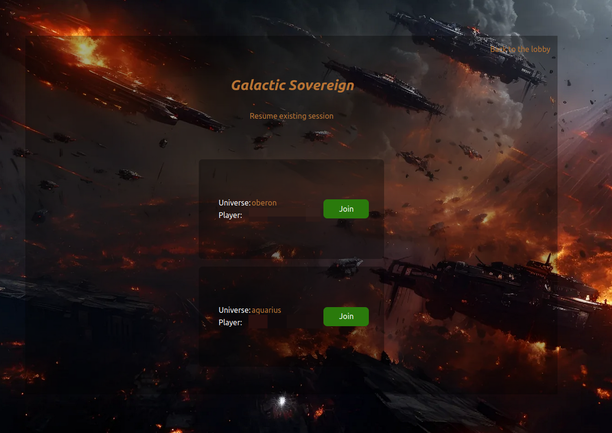

# galactic-sovereign

This repository contains the backend service powering the is [galactic-sovereign.gasteropo.de](https://galactic-sovereign.gasteropo.de) website.

On this website you can find an online multiplayer web-browser game titled **Galactic Sovereign**. This is a strategy game where the players can mine resources on their respective planets and improve the infrastructure to do so by upgrading their mines. It is largely inspired by the basics of [OGame](https://en.wikipedia.org/wiki/OGame), a famous strategy game.

Below is a screenshot of the welcome page:


Here is a view of the lobby:



And a screenshot of the actual game:


The goal of this project is to progressively migrate to a unique game concept, building the services needed for it and learning how to do it along the way.

# Overview

This project uses the following technologies:

- [postgres](https://www.postgresql.org/) for the databases.
- [go](https://go.dev/) as the server backend language.
- [docker](https://www.docker.com/) as the containerization tool to deploy services.
- [dockerhub](https://hub.docker.com/) to host the images of services and make them available.

# Badges

[](https://codecov.io/gh/Knoblauchpilze/galactic-sovereign)

[](https://github.com/Knoblauchpilze/galactic-sovereign/actions/workflows/build-and-push.yml)

[](https://github.com/Knoblauchpilze/galactic-sovereign/actions/workflows/database-migration-tests.yml)

# Installation

## Prerequisites

The tools described below are directly used by the project. It is mandatory to install them in order to build the project locally.

See the following links:

- [golang](https://go.dev/doc/install): this project was developed using go `1.23.2`.
- [golang migrate](https://github.com/golang-migrate/migrate/blob/master/cmd/migrate/README.md): following the instructions there should be enough.
- [postgresql](https://www.postgresql.org/) which can be taken from the packages with `sudo apt-get install postgresql-14` for example.
- [docker](https://docs.docker.com/engine/install/ubuntu/#install-using-the-repository) which can be installed following the instructions of the previous link.

We also assume that this repository is cloned locally and available to use. To achieve this, just use the following command:

```bash
git clone git@github.com:Knoblauchpilze/galactic-sovereign.git`
```

## Secrets in the CI

The CI workflows define several secrets that are expected to be created for the repository when cloned/forked/used. Each secret should be self-explanatory based on its name. Most of them require to setup an account on one or the other service mentioned in this README.

## Process to install

The following sections describe how to setup the local postgres server to be able to host the databases needed by the project. This includes:
- altering the postgres password if needed
- setting up the database
- connecting to the database

In addition, the following sections expect that you have access to several (secured) passwords to be used for the various users needed by the databases. The current architecture requires **3** passwords per database. It is recommended to have separate passwords and not reuse them.

## The postgres password

In order to properly execute them, make sure that you know the `postgres` password (see [this SO link](https://stackoverflow.com/questions/27107557/what-is-the-default-password-for-postgres) to alter it if needed).

The general principle is to first start a shell for the `postgres` user with:

```bash
sudo -i -u postgres
```

After this you can start a `postgres` shell with:

```bash
psql
```

Once in the shell you can alter the password of the `postgres` user with:

```sql
ALTER USER postgres PASSWORD 'your-password';
```

After exiting the shells, you should know the password for the `postgres` password and can proceed with the rest of the setup process.

## Creating the database

⚠️ In this section we will focus on setting up the galactic-sovereign database but this approach can be extended to the other databases needed by the project.

In both remote and local case, the configuration of the database happens in 3 steps:
- creation of the users to manage the database
- creation of the database
- creating the schema of the database and the relations

With the `postgres` password at hand, you can navigate to the [database](database) directory and use the following scripts defined there.

Each script requires a few environment variables to be defined in order to properly work. The very first one defines the path to reach the files related to the database to deploy. It is expected as an argument to the script. A common one is `DATABASE_PORT` which should point to the port to reach the `postgres` server. Should be `5432` (default) locally and `5000` in case of remote.

Additionally, [create_user.sh](database/create_user.sh) requires `ADMIN_PASSWORD`, `MANAGER_PASSWORD` and `USER_PASSWORD` which correspond to the three passwords you should have generated beforehand.

Finally the [Makefile](database/Makefile) to perform the migration requires to define the variables `DB_PORT` (same value as `DATABASE_PORT`) and `DB_PASSWORD` which should correspond to `ADMIN_PASSWORD`.

As a recap, here are the required steps for the remote case:

```bash
export DATABASE_PORT=5000
export ADMIN_PASSWORD='admin-password'
export MANAGER_PASSWORD='manager-password'
export USER_PASSWORD='user-password'

cd database
./create_user.sh galactic-sovereign
./create_database.sh galactic-sovereign

DB_PATH=galactic-sovereign DB_PORT=5000 DB_PASSWORD='admin-password' make migrate
```

If everything goes well for the migration, you should obtain something like this:


### Connect and inspect the database

If you want to connect to the database to inspect its content, you can use the `connect` target defined in the [Makefile](database/Makefile). Just like for the migration, it expects the `DB_PORT` and `DB_PASSWORD` environment variables to be available. An example command would be:

```bash
DB_PORT=5000 DB_PASSWORD='admin-password' make connect
```
